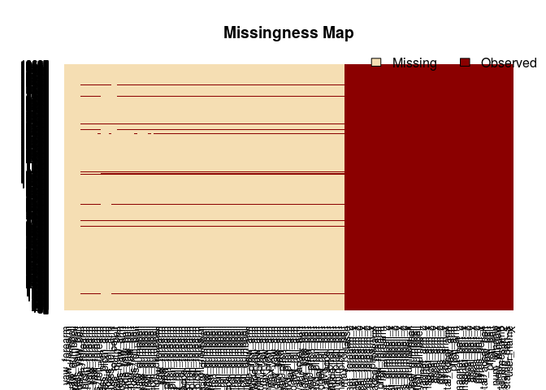
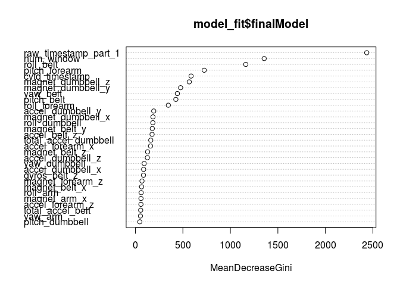

# Practical Machine Learning - Course Project
Georg Vogelhuber  
16. Juni 2015  

# Background
Using devices such as Jawbone Up, Nike FuelBand, and Fitbit it is now possible to collect a large amount of data about personal activity relatively inexpensively. These type of devices are part of the quantified self movement  a group of enthusiasts who take measurements about themselves regularly to improve their health, to find patterns in their behavior, or because they are tech geeks. One thing that people regularly do is quantify how much of a particular activity they do, but they rarely quantify how well they do it.

# Goal
The goal of this project is to predict the manner in which they did the exercise. This is the “classe” variable in the training set. We use all of the available variables to predict with. 

More detailed information on the data for this project is available from the website http://groupware.les.inf.puc-rio.br/har.

# Preliminary steps

First we load the necessary libraries and set the random seed to ensure reproducability.


```r
library(Amelia)   
library(dplyr)
library(ggplot2)
library(caret)
library(lubridate)
library(doParallel)
library(rattle)

set.seed(11111)
```

Next we read training and testing data sets:

```r
training_data <- read.csv("pml-training.csv", na.strings = c("NA", "", "#DIV/0!"))
testing_data <- read.csv("pml-testing.csv", na.strings = c("NA", "", "#DIV/0!"))
```

The missmap-plot from the Amelia-packages shows that there are several columns 
containing mostly NA values:

```r
missmap(training_data)
```

 

From the provided webpage and related papers, it is clear that the data is collected in rolling, overlapping time windows, and that the rows with `new_window == 'yes'` holds the aggregates of either the preceeding or following rows.  As there are only

```r
sum(training_data$new_window=="yes")
```

```
## [1] 406
```
of these rows, we remove them from our training data.

```r
training_data %>% filter(new_window=="no") -> training_data
```

After removing these rows, there are columns made up only of NA values. We also remove
these columns:

```r
nr_rows <- dim(training_data)[[1]]
na_count <- apply(X = training_data, 2, function(x) {sum(is.na(x))})

training_data <- tbl_df(training_data[, !(na_count == nr_rows)])
training_data %>% select(-new_window, -X) -> training_data
```

Finally the data-values in the `cvtd_timestamp` column are parsed into the date-format.

```r
training_data %>% mutate(cvtd_timestamp= dmy_hm(cvtd_timestamp)) -> training_data
testing_data %>% mutate(cvtd_timestamp= dmy_hm(cvtd_timestamp)) -> testing_data
```

Now we split the training data into a training and a cross validation set:

```r
in_train <- createDataPartition(training_data$classe, p = 0.75, list=FALSE)
training <- training_data[in_train,]
cross_validation <- training_data[-in_train,]
```

# Train Random Forest

We use a random forest classifier to build our model, because a random forrest can handle different classes for prediction very well
and has also provides good accuracy. We use a 10-fold cross-validation to train the random forrest on the `training` data.


```r
fit_control <- trainControl(
  method = "cv",
  number = 10
  )

cl <- makeCluster(3)
registerDoParallel(cl)

model_fit <- train(classe~.,
                   data=training,
                   method="rf",
                   trControl=fit_control,
                   allowParallel=TRUE )
stopCluster(cl)
```

The final model:

```r
model_fit
```

```
## Random Forest 
## 
## 14414 samples
##    57 predictors
##     5 classes: 'A', 'B', 'C', 'D', 'E' 
## 
## No pre-processing
## Resampling: Cross-Validated (10 fold) 
## 
## Summary of sample sizes: 12971, 12973, 12973, 12973, 12972, 12974, ... 
## 
## Resampling results across tuning parameters:
## 
##   mtry  Accuracy   Kappa      Accuracy SD   Kappa SD    
##    2    0.9963926  0.9954364  0.0009127932  0.0011547114
##   31    0.9986819  0.9983325  0.0007632819  0.0009656275
##   61    0.9975720  0.9969284  0.0010464643  0.0013240898
## 
## Accuracy was used to select the optimal model using  the largest value.
## The final value used for the model was mtry = 31.
```


```r
summary(model_fit$finalModel)
```

```
##                 Length Class      Mode     
## call                5  -none-     call     
## type                1  -none-     character
## predicted       14414  factor     numeric  
## err.rate         3000  -none-     numeric  
## confusion          30  -none-     numeric  
## votes           72070  matrix     numeric  
## oob.times       14414  -none-     numeric  
## classes             5  -none-     character
## importance         61  -none-     numeric  
## importanceSD        0  -none-     NULL     
## localImportance     0  -none-     NULL     
## proximity           0  -none-     NULL     
## ntree               1  -none-     numeric  
## mtry                1  -none-     numeric  
## forest             14  -none-     list     
## y               14414  factor     numeric  
## test                0  -none-     NULL     
## inbag               0  -none-     NULL     
## xNames             61  -none-     character
## problemType         1  -none-     character
## tuneValue           1  data.frame list     
## obsLevels           5  -none-     character
```

# Model evaluation

The following variables are the most important features for the final model:

```r
library(randomForest)
varImpPlot(model_fit$finalModel)
```

 
As we can see, the predicted class depends heavily on the time the exercice was executed. So
for a meaningful model one should exclude the timestamp variables. As this was not asked in
the project assignment, we keep this model.

Now we check the accuracy on the training and cross validation set:

```r
train_cm <- confusionMatrix(training$classe, predict(model_fit, training))
train_cm
```

```
## Confusion Matrix and Statistics
## 
##           Reference
## Prediction    A    B    C    D    E
##          A 4104    0    0    0    0
##          B    0 2789    0    0    0
##          C    0    0 2514    0    0
##          D    0    0    0 2361    0
##          E    0    0    0    0 2646
## 
## Overall Statistics
##                                      
##                Accuracy : 1          
##                  95% CI : (0.9997, 1)
##     No Information Rate : 0.2847     
##     P-Value [Acc > NIR] : < 2.2e-16  
##                                      
##                   Kappa : 1          
##  Mcnemar's Test P-Value : NA         
## 
## Statistics by Class:
## 
##                      Class: A Class: B Class: C Class: D Class: E
## Sensitivity            1.0000   1.0000   1.0000   1.0000   1.0000
## Specificity            1.0000   1.0000   1.0000   1.0000   1.0000
## Pos Pred Value         1.0000   1.0000   1.0000   1.0000   1.0000
## Neg Pred Value         1.0000   1.0000   1.0000   1.0000   1.0000
## Prevalence             0.2847   0.1935   0.1744   0.1638   0.1836
## Detection Rate         0.2847   0.1935   0.1744   0.1638   0.1836
## Detection Prevalence   0.2847   0.1935   0.1744   0.1638   0.1836
## Balanced Accuracy      1.0000   1.0000   1.0000   1.0000   1.0000
```


```r
cross_cm <- confusionMatrix(cross_validation$classe, predict(model_fit, cross_validation))
cross_cm
```

```
## Confusion Matrix and Statistics
## 
##           Reference
## Prediction    A    B    C    D    E
##          A 1367    0    0    0    0
##          B    0  929    0    0    0
##          C    0    0  838    0    0
##          D    0    0    0  786    0
##          E    0    0    0    0  882
## 
## Overall Statistics
##                                      
##                Accuracy : 1          
##                  95% CI : (0.9992, 1)
##     No Information Rate : 0.2847     
##     P-Value [Acc > NIR] : < 2.2e-16  
##                                      
##                   Kappa : 1          
##  Mcnemar's Test P-Value : NA         
## 
## Statistics by Class:
## 
##                      Class: A Class: B Class: C Class: D Class: E
## Sensitivity            1.0000   1.0000   1.0000   1.0000   1.0000
## Specificity            1.0000   1.0000   1.0000   1.0000   1.0000
## Pos Pred Value         1.0000   1.0000   1.0000   1.0000   1.0000
## Neg Pred Value         1.0000   1.0000   1.0000   1.0000   1.0000
## Prevalence             0.2847   0.1935   0.1745   0.1637   0.1837
## Detection Rate         0.2847   0.1935   0.1745   0.1637   0.1837
## Detection Prevalence   0.2847   0.1935   0.1745   0.1637   0.1837
## Balanced Accuracy      1.0000   1.0000   1.0000   1.0000   1.0000
```

# Sample Error

The accuracy for the training set is in the 95% confidence intervall

```r
c(train_cm$overall[3],train_cm$overall[4])
```

```
## AccuracyLower AccuracyUpper 
##     0.9997441     1.0000000
```
So the training classification error has a 95% confidence intervall of

```r
ci <- c(1-train_cm$overall[4],1-train_cm$overall[3])
names(ci) <- NULL
ci
```

```
## [1] 0.0000000000 0.0002558906
```

The accuracy for the cross validation set is in the 95% confidence intervall

```r
c(cross_cm$overall[3],cross_cm$overall[4])
```

```
## AccuracyLower AccuracyUpper 
##     0.9992321     1.0000000
```
So the out of sample classification error has a 95% confidence intervall of

```r
ci <- c(1-cross_cm$overall[4],1-cross_cm$overall[3])
names(ci) <- NULL
ci
```

```
## [1] 0.0000000000 0.0007679015
```

The estimated value for the out of sample classification error is:

```r
err <- 1-cross_cm$overall[1]
names(err) <- NULL
err
```

```
## [1] 0
```
# Prediction for test set


```r
predict(model_fit, testing_data)
```

```
##  [1] B A B A A E D B A A B C B A E E A B B B
## Levels: A B C D E
```
